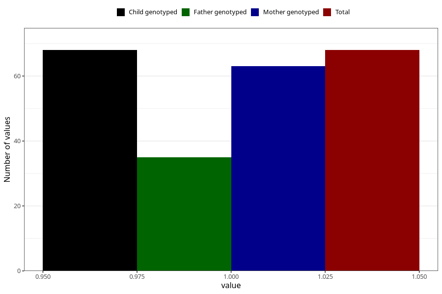

# cocaine_before
Variable mapping to `AA1446` in `Skjema1_v12`.
- Number of values:

| Value | Total | Child genotyped | Mother genotyped | Father genotyped |
| ----- | ----- | --------------- | ---------------- | ---------------- |
| Missing | 80955 | 80955 | 76166 | 53276 |
| Non-missing | 68 | 68 | 63 | 35 |
| 1 | 68 | 68 | 63 | 35 |

