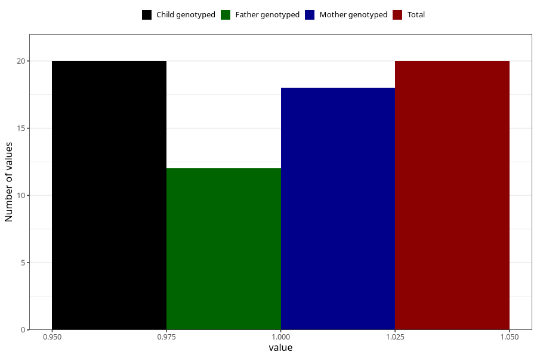

# cocaine_during
Variable mapping to `AA1447` in `Skjema1_v12`.
- Number of values:

| Value | Total | Child genotyped | Mother genotyped | Father genotyped |
| ----- | ----- | --------------- | ---------------- | ---------------- |
| Missing | 81003 | 81003 | 76211 | 53299 |
| Non-missing | 20 | 20 | 18 | 12 |
| 1 | 20 | 20 | 18 | 12 |

