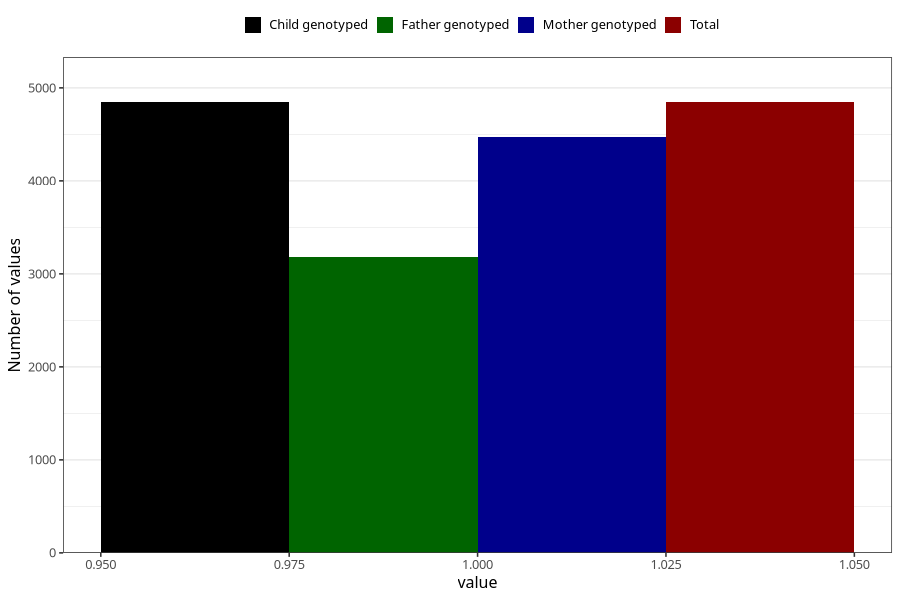

# depression_before
Variable mapping to `AA869` in `Skjema1_v12`.
- Number of values:

| Value | Total | Child genotyped | Mother genotyped | Father genotyped |
| ----- | ----- | --------------- | ---------------- | ---------------- |
| Missing | 76177 | 76177 | 71760 | 50134 |
| Non-missing | 4846 | 4846 | 4469 | 3177 |
| 1 | 4846 | 4846 | 4469 | 3177 |

