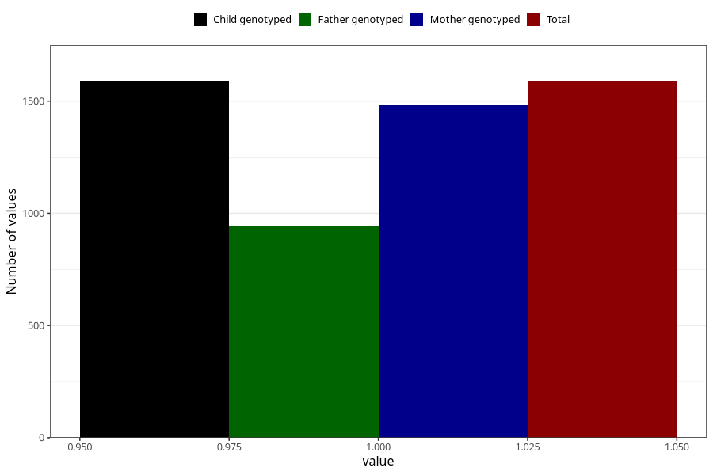

# depression_during_pregnancy_15w
Variable mapping to `AA870` in `Skjema1_v12`.
- Number of values:

| Value | Total | Child genotyped | Mother genotyped | Father genotyped |
| ----- | ----- | --------------- | ---------------- | ---------------- |
| Missing | 79433 | 79433 | 74747 | 52370 |
| Non-missing | 1590 | 1590 | 1482 | 941 |
| 1 | 1590 | 1590 | 1482 | 941 |

