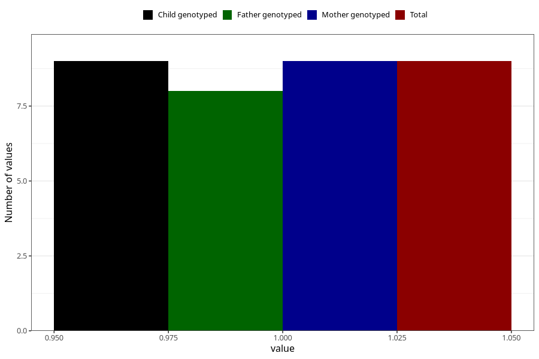

# ecstasy_during
Variable mapping to `AA1443` in `Skjema1_v12`.
- Number of values:

| Value | Total | Child genotyped | Mother genotyped | Father genotyped |
| ----- | ----- | --------------- | ---------------- | ---------------- |
| Missing | 81014 | 81014 | 76220 | 53303 |
| Non-missing | 9 | 9 | 9 | 8 |
| 1 | 9 | 9 | 9 | 8 |

