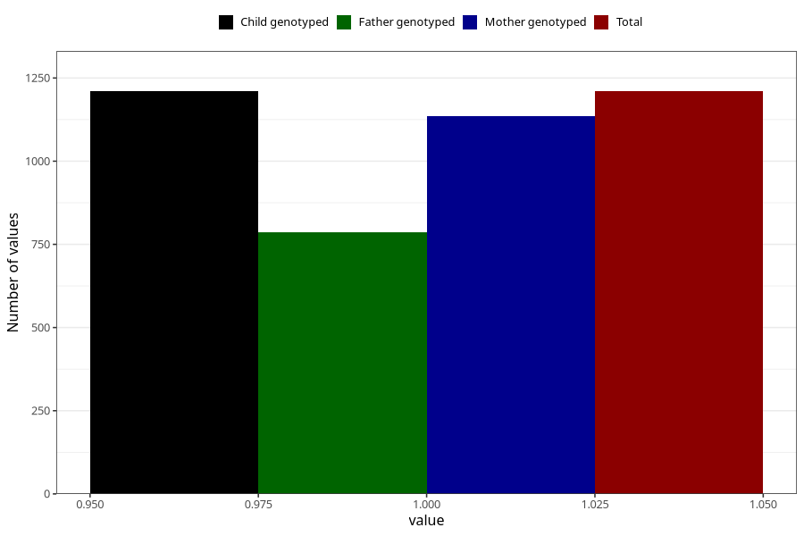

# endometriosis_before
Variable mapping to `AA689` in `Skjema1_v12`.
- Number of values:

| Value | Total | Child genotyped | Mother genotyped | Father genotyped |
| ----- | ----- | --------------- | ---------------- | ---------------- |
| Missing | 79813 | 79813 | 75094 | 52526 |
| Non-missing | 1210 | 1210 | 1135 | 785 |
| 1 | 1210 | 1210 | 1135 | 785 |

