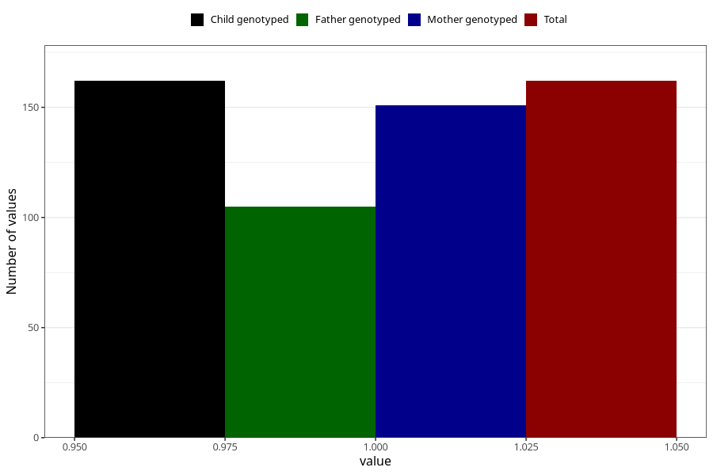

# endometriosis_during
Variable mapping to `AA690` in `Skjema1_v12`.
- Number of values:

| Value | Total | Child genotyped | Mother genotyped | Father genotyped |
| ----- | ----- | --------------- | ---------------- | ---------------- |
| Missing | 80861 | 80861 | 76078 | 53206 |
| Non-missing | 162 | 162 | 151 | 105 |
| 1 | 162 | 162 | 151 | 105 |

