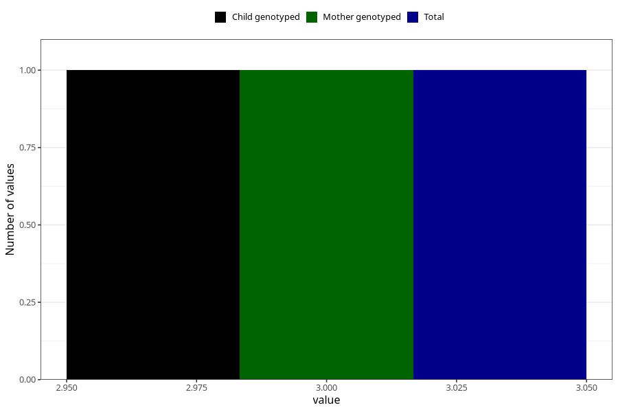

# ever_had_lack_of_energy_before_pregnancy
Variable mapping to `AA1574` in `Skjema1_v12`.
- Number of values:

| Value | Total | Child genotyped | Mother genotyped | Father genotyped |
| ----- | ----- | --------------- | ---------------- | ---------------- |
| Missing | 5634 | 5634 | 5259 | 3208 |
| Non-missing | 75389 | 75389 | 70970 | 50103 |
| More than 1 check box filled in | 12 | 12 | 10 |9 |
| No | 34591 | 34591 | 32695 |23461 |
| Yes | 40785 | 40785 | 38264 |26633 |
| 3 | 1 | 1 | 1 | 0 |

