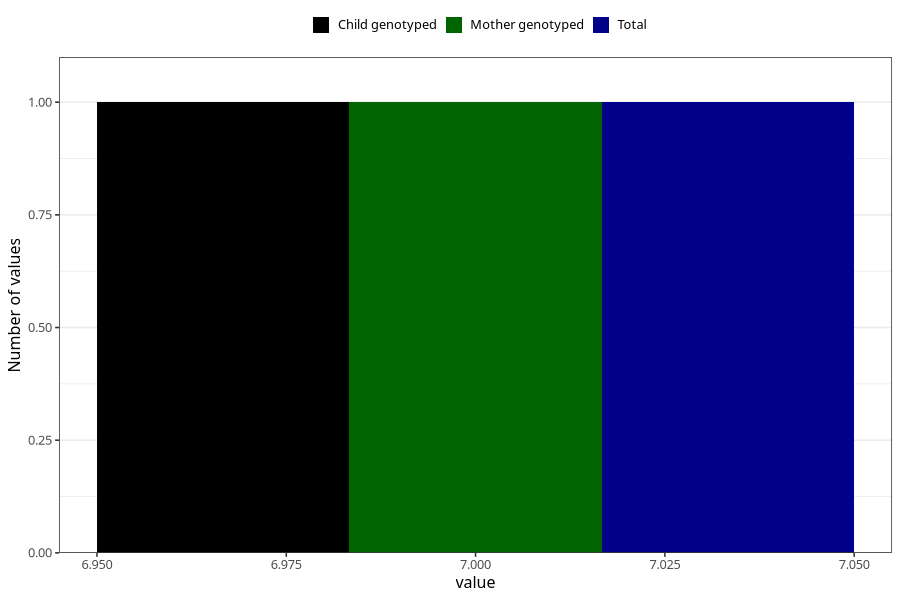

# frequently_disagree_with_partner_on_important_decisions_15w
Variable mapping to `AA1538` in `Skjema1_v12`.
- Number of values:

| Value | Total | Child genotyped | Mother genotyped | Father genotyped |
| ----- | ----- | --------------- | ---------------- | ---------------- |
| Missing | 8489 | 8489 | 7975 | 3814 |
| Non-missing | 72534 | 72534 | 68254 | 49497 |
| (1+2) | 1 | 1 | 1 |1 |
| (1+4) | 1 | 1 | 1 |1 |
| (1+6) | 2 | 2 | 2 |2 |
| (2+3) | 5 | 5 | 4 |5 |
| (2+4) | 2 | 2 | 1 |0 |
| (2+5) | 6 | 6 | 5 |5 |
| (2+6) | 7 | 7 | 7 |3 |
| (3+4) | 7 | 7 | 7 |7 |
| (3+5) | 2 | 2 | 2 |2 |
| (4+5) | 4 | 4 | 4 |2 |
| (5+6) | 3 | 3 | 3 |1 |
| Agree | 2521 | 2521 | 2353 |1527 |
| Agree somewhat | 6767 | 6767 | 6370 |4143 |
| Disagree | 31423 | 31423 | 29597 |21606 |
| Disagree somewhat | 7466 | 7466 | 7008 |4760 |
| More than 1 check box filled in | 3 | 3 | 3 |3 |
| Strongly agree | 918 | 918 | 852 |576 |
| Strongly disagree | 23395 | 23395 | 22033 |16853 |
| 7 | 1 | 1 | 1 | 0 |

