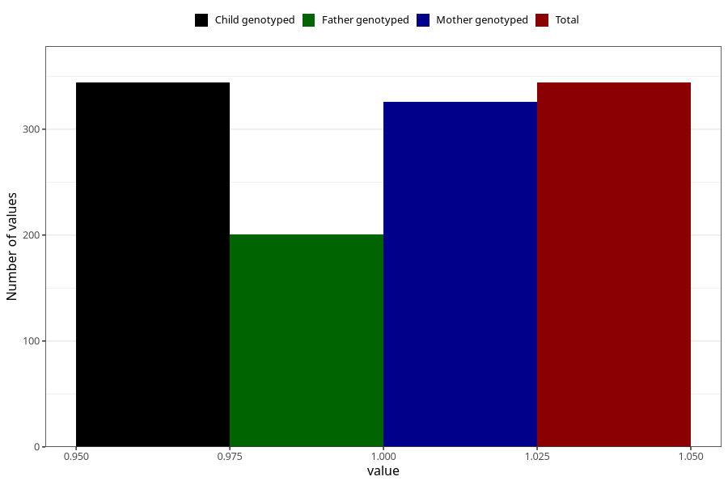

# hash_before
Variable mapping to `AA1434` in `Skjema1_v12`.
- Number of values:

| Value | Total | Child genotyped | Mother genotyped | Father genotyped |
| ----- | ----- | --------------- | ---------------- | ---------------- |
| Missing | 80679 | 80679 | 75903 | 53110 |
| Non-missing | 344 | 344 | 326 | 201 |
| 1 | 344 | 344 | 326 | 201 |

