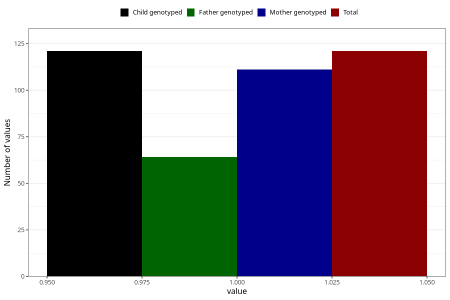

# hash_during
Variable mapping to `AA1435` in `Skjema1_v12`.
- Number of values:

| Value | Total | Child genotyped | Mother genotyped | Father genotyped |
| ----- | ----- | --------------- | ---------------- | ---------------- |
| Missing | 80902 | 80902 | 76118 | 53247 |
| Non-missing | 121 | 121 | 111 | 64 |
| 1 | 121 | 121 | 111 | 64 |

