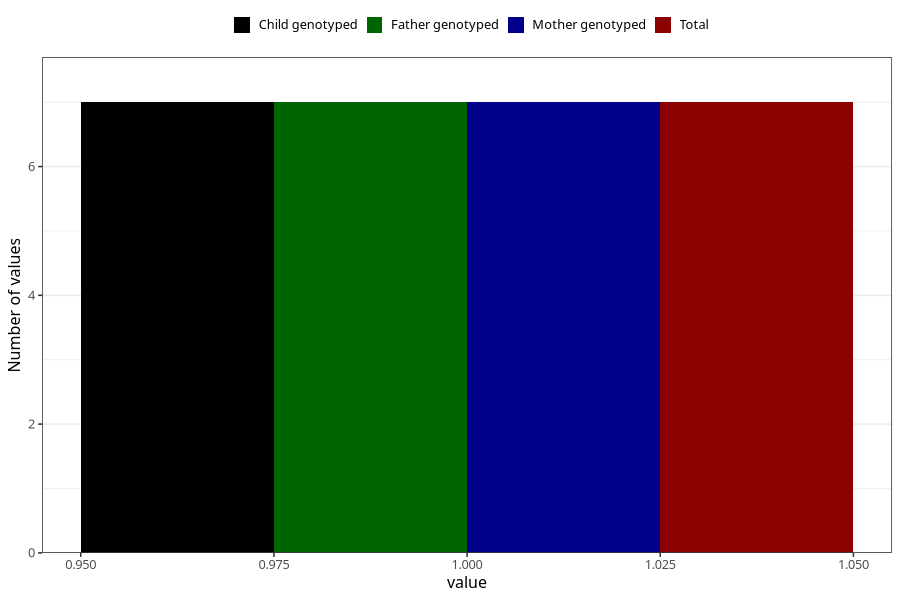

# heroin_during
Variable mapping to `AA1451` in `Skjema1_v12`.
- Number of values:

| Value | Total | Child genotyped | Mother genotyped | Father genotyped |
| ----- | ----- | --------------- | ---------------- | ---------------- |
| Missing | 81016 | 81016 | 76222 | 53304 |
| Non-missing | 7 | 7 | 7 | 7 |
| 1 | 7 | 7 | 7 | 7 |

