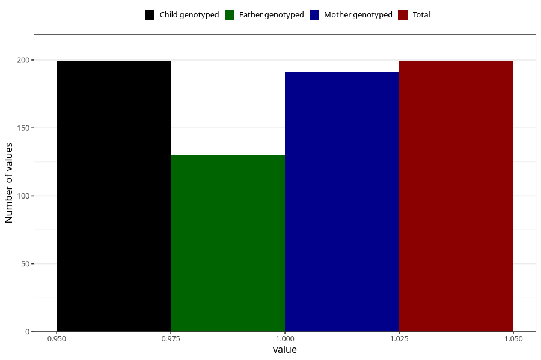

# high_cholesterol_during
Variable mapping to `AA546` in `Skjema1_v12`.
- Number of values:

| Value | Total | Child genotyped | Mother genotyped | Father genotyped |
| ----- | ----- | --------------- | ---------------- | ---------------- |
| Missing | 80824 | 80824 | 76038 | 53181 |
| Non-missing | 199 | 199 | 191 | 130 |
| 1 | 199 | 199 | 191 | 130 |

