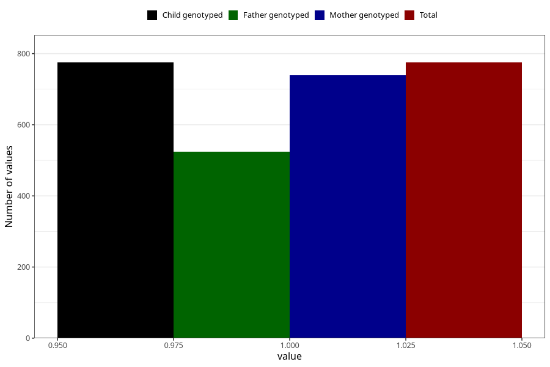

# highest_blood_pressure_before_pregnancy
Variable mapping to `AA554` in `Skjema1_v12`.
- Number of values:

| Value | Total | Child genotyped | Mother genotyped | Father genotyped |
| ----- | ----- | --------------- | ---------------- | ---------------- |
| Missing | 80248 | 80248 | 75490 | 52786 |
| Non-missing | 775 | 775 | 739 | 525 |
| 1 | 775 | 775 | 739 | 525 |

