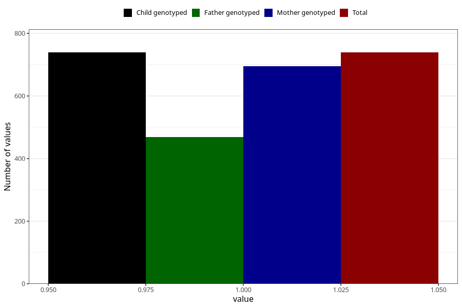

# highest_blood_pressure_during_pregnancy_15w
Variable mapping to `AA555` in `Skjema1_v12`.
- Number of values:

| Value | Total | Child genotyped | Mother genotyped | Father genotyped |
| ----- | ----- | --------------- | ---------------- | ---------------- |
| Missing | 80284 | 80284 | 75534 | 52842 |
| Non-missing | 739 | 739 | 695 | 469 |
| 1 | 739 | 739 | 695 | 469 |

