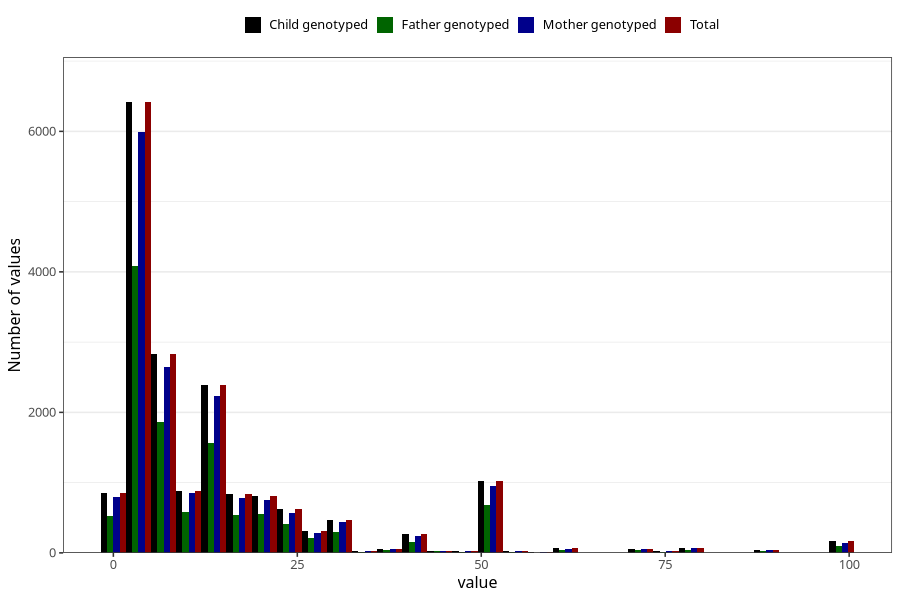

# three_lth_md_duration_before_pregnancy
Variable mapping to `AA1578` in `Skjema1_v12`.
- Number of values:

| Value | Total | Child genotyped | Mother genotyped | Father genotyped |
| ----- | ----- | --------------- | ---------------- | ---------------- |
| Missing | 62717 | 62717 | 59120 | 41495 |
| Non-missing | 18306 | 18306 | 17109 | 11816 |
| 25th percentile | 4 | 4 | 4 | 4 |
| 50th percentile | 8 | 8 | 8 | 8 |
| 75th percentile | 16 | 16 | 16 | 16 |
| Mean | 13.9139626352016 | 13.9139626352016 | 13.8712958092232 | 14.0138794854435 |
| Standard deviation | 16.9791515251687 | 16.9791515251687 | 16.9082067580638 | 16.952113790838 |
| N | 18306 | 18306 | 17109 | 11816 |

