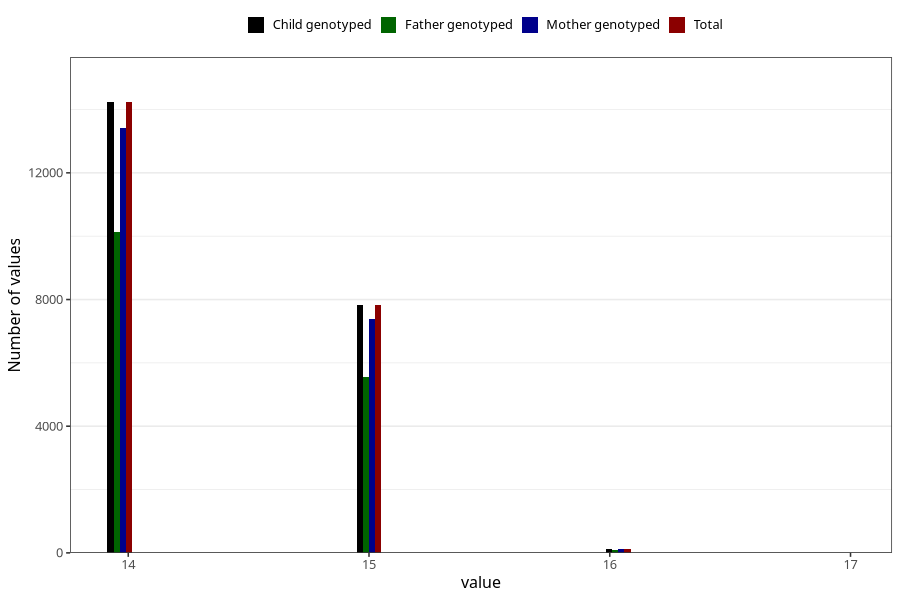

# age_answering_q_14m
Variable mapping to `AGE_YRS_UM` in `Ungdomsskjema_Mor_v12_standard`.
- Number of values:

| Value | Total | Child genotyped | Mother genotyped | Father genotyped |
| ----- | ----- | --------------- | ---------------- | ---------------- |
| Missing | 58830 | 58830 | 55322 | 37548 |
| Non-missing | 22193 | 22193 | 20907 | 15763 |
| 14 | 14231 | 14231 | 13408 | 10126 |
| 15 | 7826 | 7826 | 7372 | 5546 |
| 16 | 134 | 134 | 125 | 89 |
| 17 | 2 | 2 | 2 | 2 |

