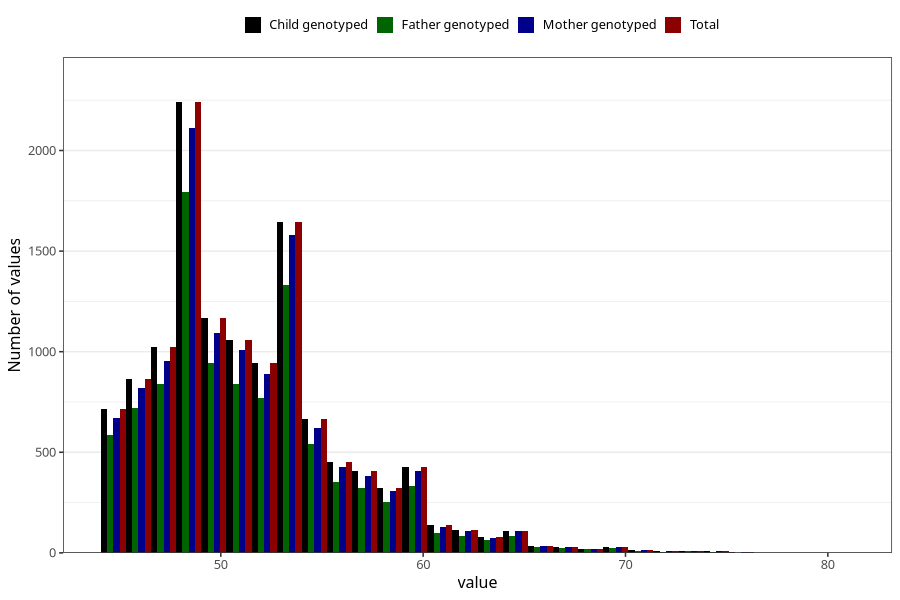

# age_answering_q_45f
Variable mapping to `AGE_YRS_LF` in `MobaForeldre45_Far_v12_standard`.
- Number of values:

| Value | Total | Child genotyped | Mother genotyped | Father genotyped |
| ----- | ----- | --------------- | ---------------- | ---------------- |
| Missing | 68487 | 68487 | 64390 | 43232 |
| Non-missing | 12536 | 12536 | 11839 | 10079 |
| 25th percentile | 48 | 48 | 48 | 48 |
| 50th percentile | 51 | 51 | 51 | 51 |
| 75th percentile | 54 | 54 | 54 | 54 |
| Mean | 51.5404435226548 | 51.5404435226548 | 51.5537629867387 | 51.4609584284155 |
| Standard deviation | 4.75842833487176 | 4.75842833487176 | 4.76254472139203 | 4.71123255203089 |
| N | 12536 | 12536 | 11839 | 10079 |

