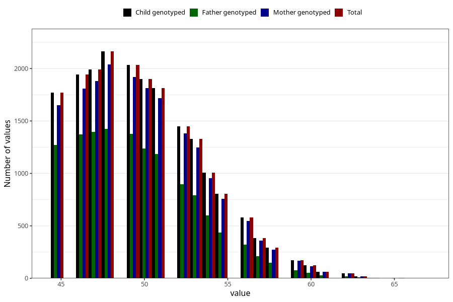

# age_answering_q_45m
Variable mapping to `AGE_YRS_LM` in `MobaForeldre45_Mor_v12_standard`.
- Number of values:

| Value | Total | Child genotyped | Mother genotyped | Father genotyped |
| ----- | ----- | --------------- | ---------------- | ---------------- |
| Missing | 61130 | 61130 | 57459 | 40466 |
| Non-missing | 19893 | 19893 | 18770 | 12845 |
| 25th percentile | 47 | 47 | 47 | 47 |
| 50th percentile | 50 | 50 | 50 | 49 |
| 75th percentile | 52 | 52 | 52 | 52 |
| Mean | 50.03543960187 | 50.03543960187 | 50.0533830580714 | 49.6981704943558 |
| Standard deviation | 3.64508554862306 | 3.64508554862306 | 3.6465425597089 | 3.47803991913837 |
| N | 19893 | 19893 | 18770 | 12845 |

