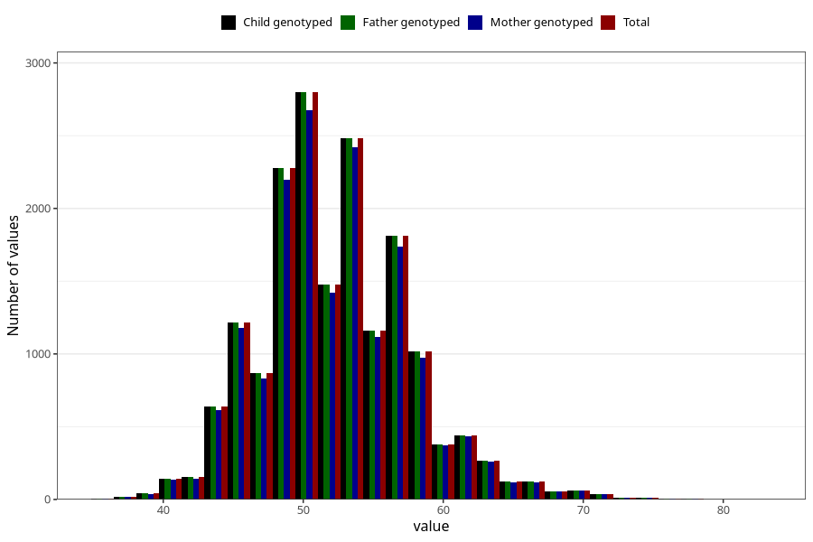

# age_answering_q_hf
Variable mapping to `AGE_YRS_HF` in `HelseFedre`.
- Number of values:

| Value | Total | Child genotyped | Mother genotyped | Father genotyped |
| ----- | ----- | --------------- | ---------------- | ---------------- |
| Missing | 63404 | 63404 | 59230 | 35692 |
| Non-missing | 17619 | 17619 | 16999 | 17619 |
| 25th percentile | 49 | 49 | 49 | 49 |
| 50th percentile | 52 | 52 | 52 | 52 |
| 75th percentile | 55 | 55 | 55 | 55 |
| Mean | 52.2983143197684 | 52.2983143197684 | 52.3196658626978 | 52.2983143197684 |
| Standard deviation | 5.34030940356324 | 5.34030940356324 | 5.35191126723751 | 5.34030940356324 |
| N | 17619 | 17619 | 16999 | 17619 |

