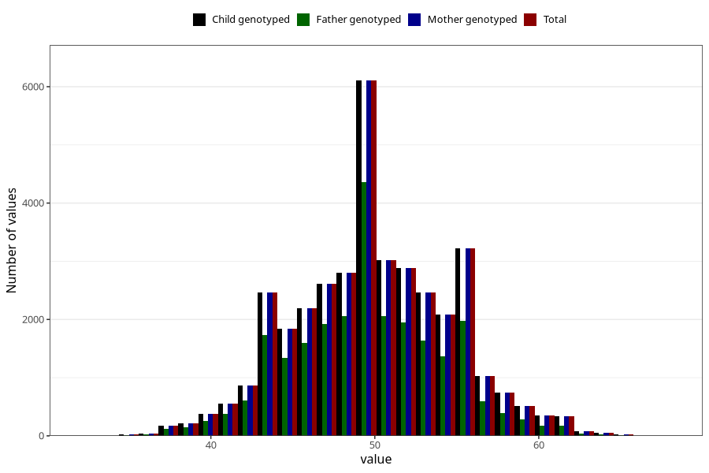

# age_answering_q_hm
Variable mapping to `AGE_YRS_HM` in `HelseModre`.
- Number of values:

| Value | Total | Child genotyped | Mother genotyped | Father genotyped |
| ----- | ----- | --------------- | ---------------- | ---------------- |
| Missing | 43947 | 43947 | 39153 | 28091 |
| Non-missing | 37076 | 37076 | 37076 | 25220 |
| 25th percentile | 47 | 47 | 47 | 47 |
| 50th percentile | 50 | 50 | 50 | 50 |
| 75th percentile | 53 | 53 | 53 | 53 |
| Mean | 49.9475401877225 | 49.9475401877225 | 49.9475401877225 | 49.6330293417922 |
| Standard deviation | 4.77116243510965 | 4.77116243510965 | 4.77116243510965 | 4.58422674840326 |
| N | 37076 | 37076 | 37076 | 25220 |

