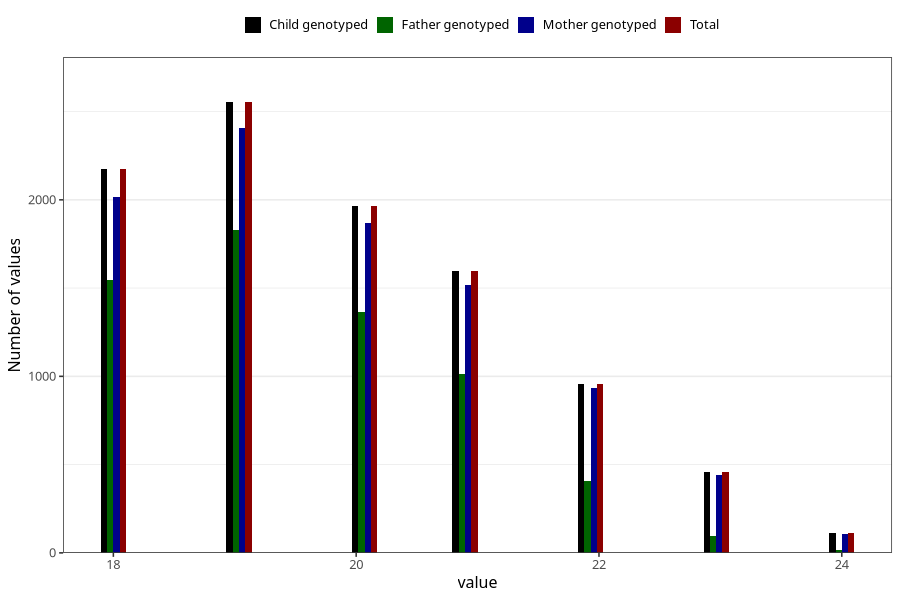

# age_answering_q_ung
Variable mapping to `AGE_YRS_UH` in `UngHelse_standard`.
- Number of values:

| Value | Total | Child genotyped | Mother genotyped | Father genotyped |
| ----- | ----- | --------------- | ---------------- | ---------------- |
| Missing | 71205 | 71205 | 66938 | 47036 |
| Non-missing | 9818 | 9818 | 9291 | 6275 |
| 18 | 2176 | 2176 | 2015 | 1548 |
| 19 | 2553 | 2553 | 2408 | 1828 |
| 20 | 1967 | 1967 | 1870 | 1366 |
| 21 | 1596 | 1596 | 1519 | 1016 |
| 22 | 959 | 959 | 932 | 405 |
| 23 | 457 | 457 | 442 | 94 |
| 24 | 110 | 110 | 105 | 18 |

