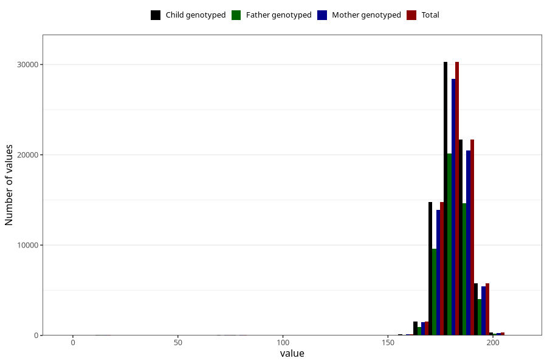

# father_height_15w
Variable mapping to `AA88` in `Skjema1_v12`.
- Number of values:

| Value | Total | Child genotyped | Mother genotyped | Father genotyped |
| ----- | ----- | --------------- | ---------------- | ---------------- |
| Missing | 6317 | 6317 | 5891 | 3543 |
| Non-missing | 74706 | 74706 | 70338 | 49768 |
| 25th percentile | 178 | 178 | 178 | 178 |
| 50th percentile | 181 | 181 | 181 | 182 |
| 75th percentile | 186 | 186 | 186 | 186 |
| Mean | 181.2262468878 | 181.2262468878 | 181.256447439506 | 181.402226330172 |
| Standard deviation | 9.70529397169064 | 9.70529397169064 | 9.61909751455704 | 9.50448562085745 |
| N | 74706 | 74706 | 70338 | 49768 |

