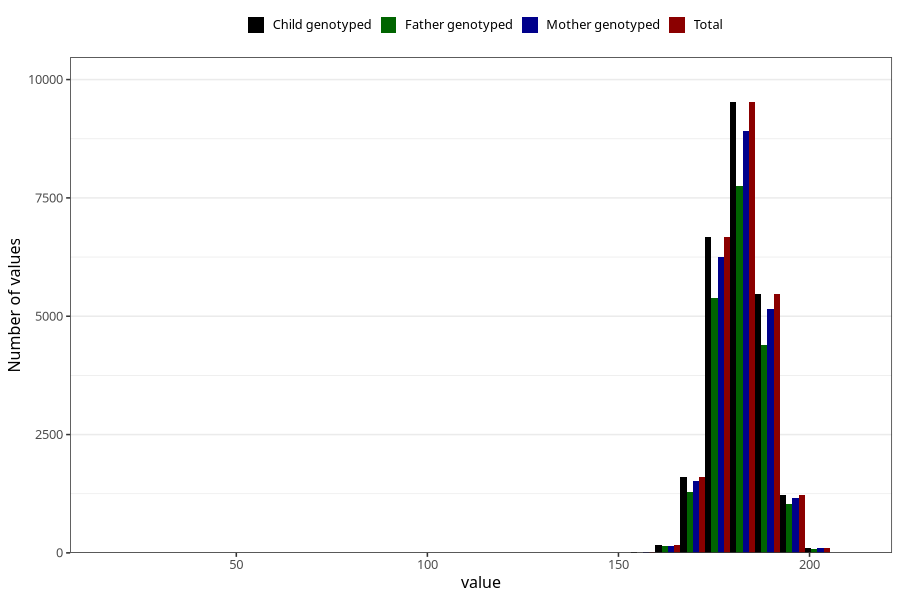

# father_height_self_15w
Variable mapping to `FF333` in `SkjemaFar_v12`.
- Number of values:

| Value | Total | Child genotyped | Mother genotyped | Father genotyped |
| ----- | ----- | --------------- | ---------------- | ---------------- |
| Missing | 56218 | 56218 | 52960 | 33261 |
| Non-missing | 24805 | 24805 | 23269 | 20050 |
| 25th percentile | 178 | 178 | 178 | 178 |
| 50th percentile | 182 | 182 | 182 | 182 |
| 75th percentile | 186 | 186 | 186 | 186 |
| Mean | 181.779560572465 | 181.779560572465 | 181.793244230521 | 181.823441396509 |
| Standard deviation | 6.761035754042 | 6.761035754042 | 6.77339031164986 | 6.73115468851758 |
| N | 24805 | 24805 | 23269 | 20050 |

