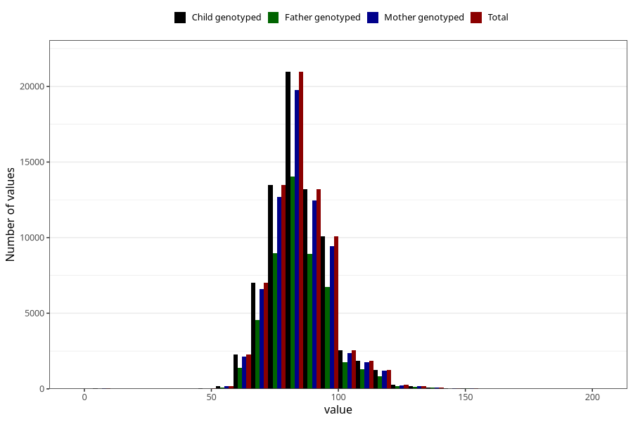

# father_weight_15w
Variable mapping to `AA89` in `Skjema1_v12`.
- Number of values:

| Value | Total | Child genotyped | Mother genotyped | Father genotyped |
| ----- | ----- | --------------- | ---------------- | ---------------- |
| Missing | 7490 | 7490 | 6991 | 4239 |
| Non-missing | 73533 | 73533 | 69238 | 49072 |
| 25th percentile | 77 | 77 | 77 | 77 |
| 50th percentile | 84 | 84 | 84 | 84 |
| 75th percentile | 92 | 92 | 92 | 92 |
| Mean | 85.178912869052 | 85.178912869052 | 85.1550304745949 | 85.3671136289534 |
| Standard deviation | 12.3009596367197 | 12.3009596367197 | 12.2707726106847 | 12.2245781079659 |
| N | 73533 | 73533 | 69238 | 49072 |

