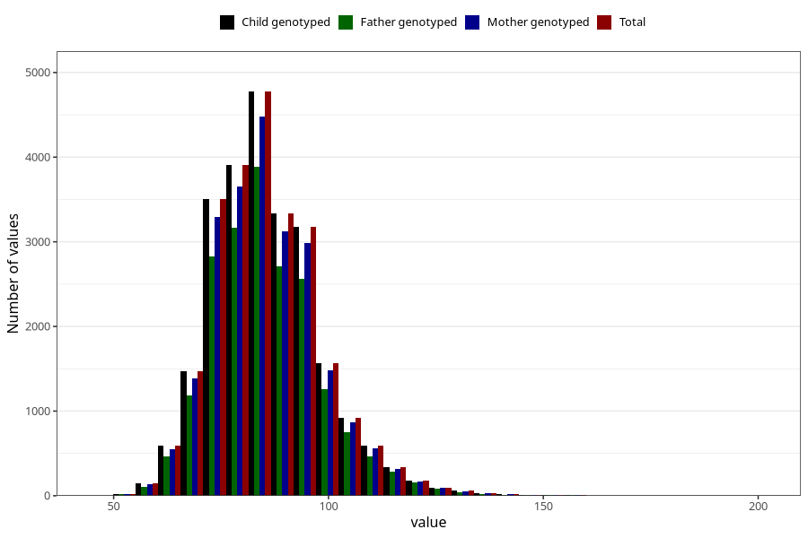

# father_weight_self_15w
Variable mapping to `FF334` in `SkjemaFar_v12`.
- Number of values:

| Value | Total | Child genotyped | Mother genotyped | Father genotyped |
| ----- | ----- | --------------- | ---------------- | ---------------- |
| Missing | 56248 | 56248 | 52986 | 33284 |
| Non-missing | 24775 | 24775 | 23243 | 20027 |
| 25th percentile | 77 | 77 | 77 | 77 |
| 50th percentile | 85 | 85 | 85 | 85 |
| 75th percentile | 93 | 93 | 93 | 93 |
| Mean | 85.7826397578204 | 85.7826397578204 | 85.7528417157854 | 85.8008788136016 |
| Standard deviation | 12.5694137973817 | 12.5694137973817 | 12.4867832714011 | 12.491065986469 |
| N | 24775 | 24775 | 23243 | 20027 |

