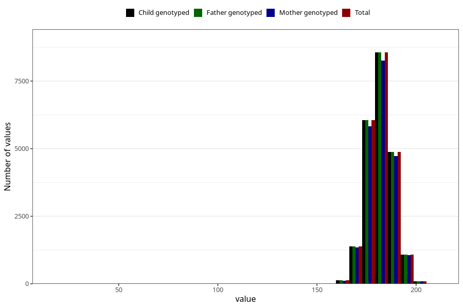

# height_father15
Variable mapping to `G__5` in `Far2_V12`.
- Number of values:

| Value | Total | Child genotyped | Mother genotyped | Father genotyped |
| ----- | ----- | --------------- | ---------------- | ---------------- |
| Missing | 58817 | 58817 | 54812 | 31105 |
| Non-missing | 22206 | 22206 | 21417 | 22206 |
| 25th percentile | 178 | 178 | 178 | 178 |
| 50th percentile | 182 | 182 | 182 | 182 |
| 75th percentile | 186 | 186 | 186 | 186 |
| Mean | 181.81595064397 | 181.81595064397 | 181.830415090816 | 181.81595064397 |
| Standard deviation | 6.77169357206209 | 6.77169357206209 | 6.78864739488542 | 6.77169357206209 |
| N | 22206 | 22206 | 21417 | 22206 |

