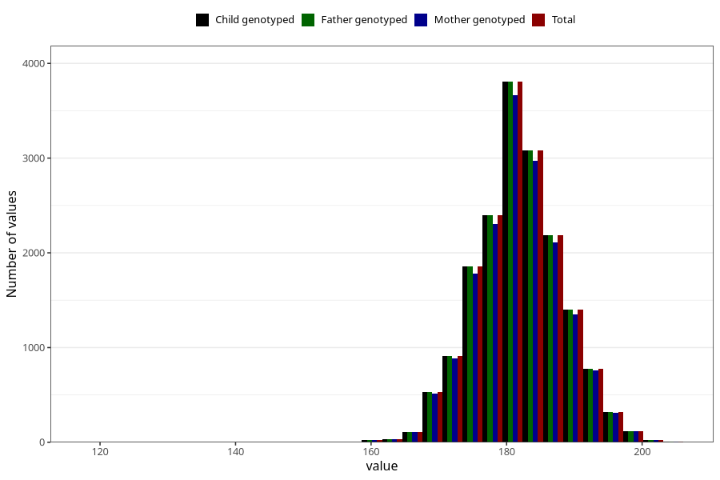

# height_hf
Variable mapping to `HF127` in `HelseFedre`.
- Number of values:

| Value | Total | Child genotyped | Mother genotyped | Father genotyped |
| ----- | ----- | --------------- | ---------------- | ---------------- |
| Missing | 63440 | 63440 | 59266 | 35728 |
| Non-missing | 17583 | 17583 | 16963 | 17583 |
| 25th percentile | 178 | 178 | 178 | 178 |
| 50th percentile | 182 | 182 | 182 | 182 |
| 75th percentile | 186 | 186 | 186 | 186 |
| Mean | 181.860717738725 | 181.860717738725 | 181.879502446501 | 181.860717738725 |
| Standard deviation | 6.36978053539176 | 6.36978053539176 | 6.38560508528291 | 6.36978053539176 |
| N | 17583 | 17583 | 16963 | 17583 |

