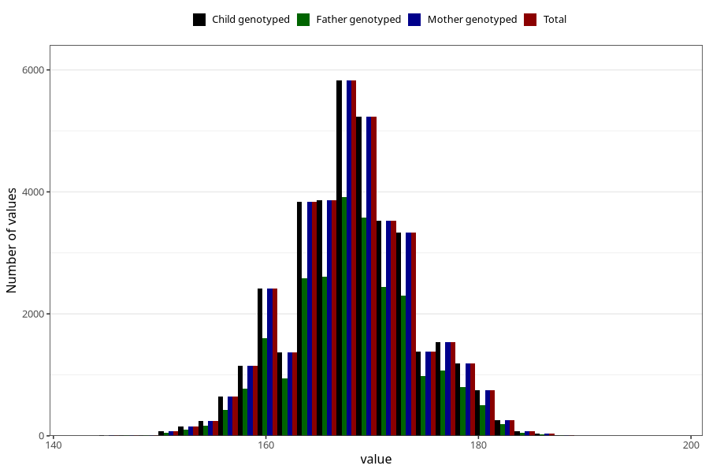

# height_hm
Variable mapping to `HM259` in `HelseModre`.
- Number of values:

| Value | Total | Child genotyped | Mother genotyped | Father genotyped |
| ----- | ----- | --------------- | ---------------- | ---------------- |
| Missing | 44085 | 44085 | 39291 | 28172 |
| Non-missing | 36938 | 36938 | 36938 | 25139 |
| 25th percentile | 164 | 164 | 164 | 164 |
| 50th percentile | 168 | 168 | 168 | 168 |
| 75th percentile | 172 | 172 | 172 | 172 |
| Mean | 168.178082191781 | 168.178082191781 | 168.178082191781 | 168.244401129719 |
| Standard deviation | 5.88280784981193 | 5.88280784981193 | 5.88280784981193 | 5.88320298065606 |
| N | 36938 | 36938 | 36938 | 25139 |

