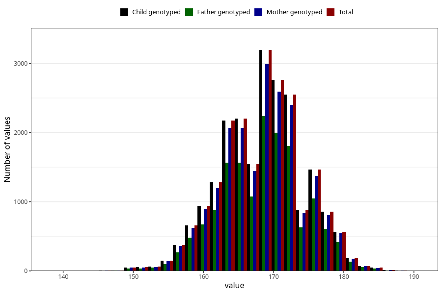

# height_mother_14m
Variable mapping to `UM271` in `Ungdomsskjema_Mor_v12_standard`.
- Number of values:

| Value | Total | Child genotyped | Mother genotyped | Father genotyped |
| ----- | ----- | --------------- | ---------------- | ---------------- |
| Missing | 58937 | 58937 | 55427 | 37620 |
| Non-missing | 22086 | 22086 | 20802 | 15691 |
| 25th percentile | 164 | 164 | 164 | 164 |
| 50th percentile | 168 | 168 | 168 | 168 |
| 75th percentile | 172 | 172 | 172 | 172 |
| Mean | 168.26514534094 | 168.26514534094 | 168.270743197769 | 168.312854502581 |
| Standard deviation | 5.87889749575617 | 5.87889749575617 | 5.89197000406728 | 5.8783893969593 |
| N | 22086 | 22086 | 20802 | 15691 |

