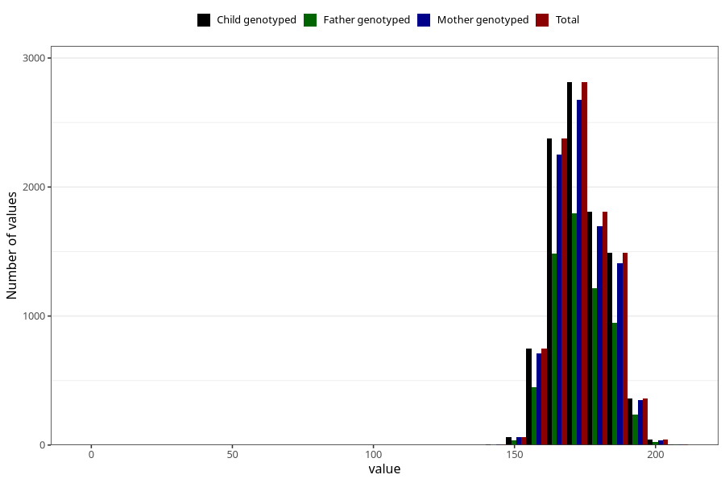

# height_ung
Variable mapping to `UH51` in `UngHelse_standard`.
- Number of values:

| Value | Total | Child genotyped | Mother genotyped | Father genotyped |
| ----- | ----- | --------------- | ---------------- | ---------------- |
| Missing | 71300 | 71300 | 67025 | 47099 |
| Non-missing | 9723 | 9723 | 9204 | 6212 |
| 25th percentile | 167 | 167 | 167 | 167 |
| 50th percentile | 173 | 173 | 173 | 173 |
| 75th percentile | 180 | 180 | 180 | 180 |
| Mean | 173.469813843464 | 173.469813843464 | 173.473055193394 | 173.622504829363 |
| Standard deviation | 10.0761444273892 | 10.0761444273892 | 9.88061033972216 | 10.1303830974446 |
| N | 9723 | 9723 | 9204 | 6212 |

