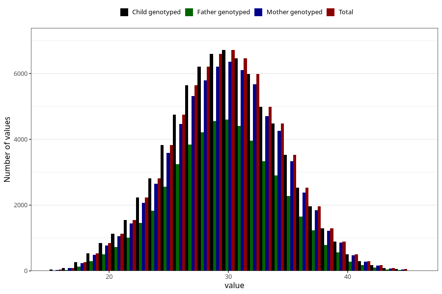

# mother_age_15w
Variable mapping to `MOR_ALDERUTFYLT_S1` in `Skjema1_v12`.
- Number of values:

| Value | Total | Child genotyped | Mother genotyped | Father genotyped |
| ----- | ----- | --------------- | ---------------- | ---------------- |
| Missing | 4514 | 4514 | 4206 | 2513 |
| Non-missing | 76509 | 76509 | 72023 | 50798 |
| 25th percentile | 27 | 27 | 27 | 27 |
| 50th percentile | 30 | 30 | 30 | 30 |
| 75th percentile | 33 | 33 | 33 | 33 |
| Mean | 29.744683631991 | 29.744683631991 | 29.7670049845188 | 29.7132761132328 |
| Standard deviation | 4.53907915015661 | 4.53907915015661 | 4.52842866417497 | 4.42085585669609 |
| N | 76509 | 76509 | 72023 | 50798 |

