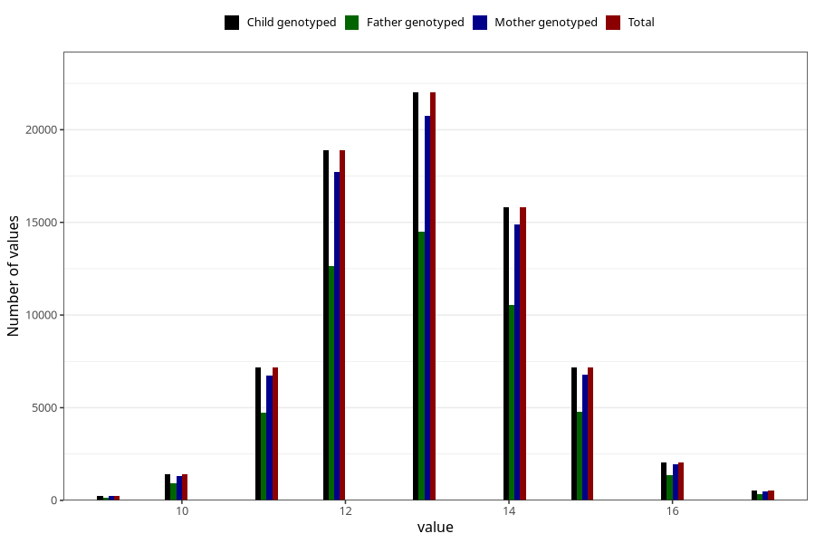

# mother_age_at_menarche
Variable mapping to `AA12` in `Skjema1_v12`.
- Number of values:

| Value | Total | Child genotyped | Mother genotyped | Father genotyped |
| ----- | ----- | --------------- | ---------------- | ---------------- |
| Missing | 5703 | 5703 | 5331 | 3300 |
| Non-missing | 75320 | 75320 | 70898 | 50011 |
| 9 | 228 | 228 | 218 | 150 |
| 10 | 1411 | 1411 | 1330 | 929 |
| 11 | 7192 | 7192 | 6754 | 4719 |
| 12 | 18869 | 18869 | 17698 | 12651 |
| 13 | 22009 | 22009 | 20762 | 14507 |
| 14 | 15829 | 15829 | 14909 | 10562 |
| 15 | 7195 | 7195 | 6790 | 4798 |
| 16 | 2061 | 2061 | 1941 | 1352 |
| 17 | 526 | 526 | 496 | 343 |

