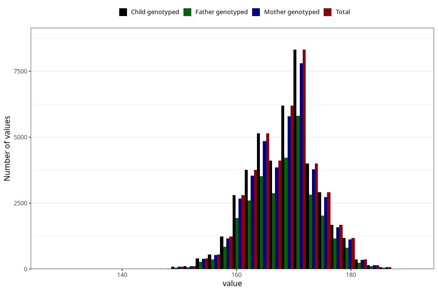

# mother_height_3y
Variable mapping to `GG502` in `Skjema6_3aar_v12`.
- Number of values:

| Value | Total | Child genotyped | Mother genotyped | Father genotyped |
| ----- | ----- | --------------- | ---------------- | ---------------- |
| Missing | 37898 | 37898 | 35664 | 23505 |
| Non-missing | 43125 | 43125 | 40565 | 29806 |
| 25th percentile | 164 | 164 | 164 | 164 |
| 50th percentile | 168 | 168 | 168 | 168 |
| 75th percentile | 172 | 172 | 172 | 172 |
| Mean | 168.349913043478 | 168.349913043478 | 168.346850733391 | 168.3746896598 |
| Standard deviation | 5.85283098660681 | 5.85283098660681 | 5.86716054637715 | 5.83596570857796 |
| N | 43125 | 43125 | 40565 | 29806 |

