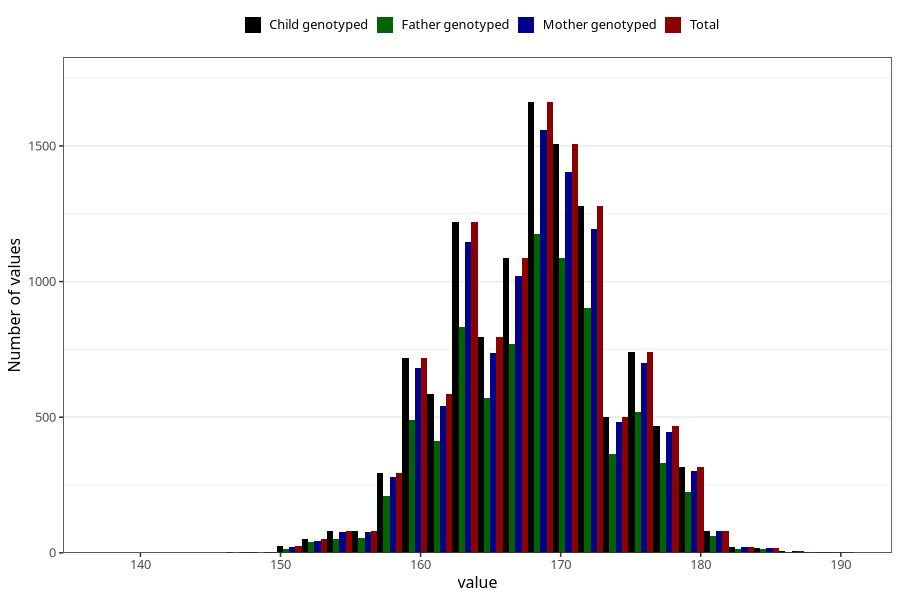

# mother_height_5y
Variable mapping to `LL338` in `Skjema5aar_v12`.
- Number of values:

| Value | Total | Child genotyped | Mother genotyped | Father genotyped |
| ----- | ----- | --------------- | ---------------- | ---------------- |
| Missing | 69471 | 69471 | 65379 | 45162 |
| Non-missing | 11552 | 11552 | 10850 | 8149 |
| 25th percentile | 164 | 164 | 164 | 164 |
| 50th percentile | 168 | 168 | 168 | 168 |
| 75th percentile | 172 | 172 | 172 | 172 |
| Mean | 168.26506232687 | 168.26506232687 | 168.287649769585 | 168.325315989692 |
| Standard deviation | 5.8571455084054 | 5.8571455084054 | 5.87496257663854 | 5.84071614276026 |
| N | 11552 | 11552 | 10850 | 8149 |

