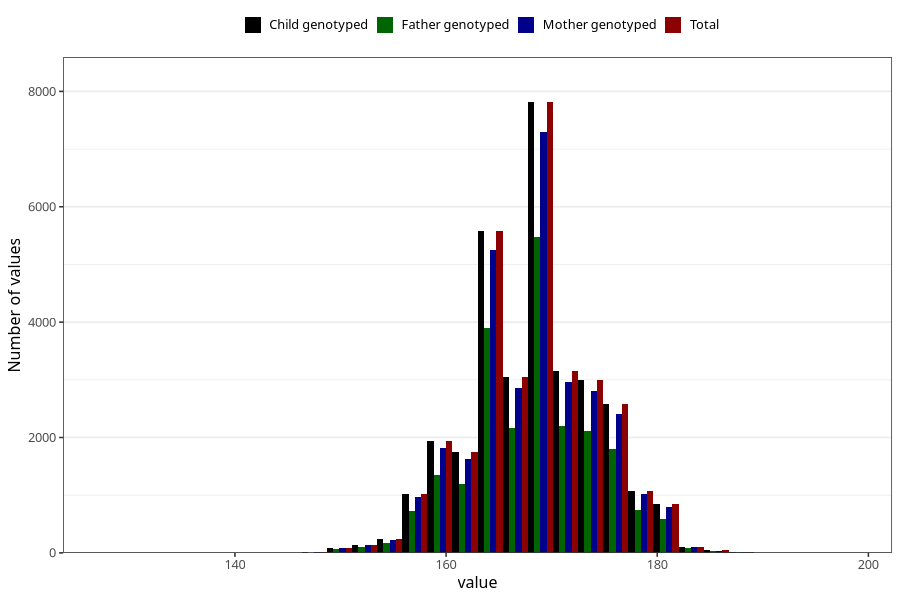

# mother_height_8y
Variable mapping to `NN283` in `Skjema8aar_v12`.
- Number of values:

| Value | Total | Child genotyped | Mother genotyped | Father genotyped |
| ----- | ----- | --------------- | ---------------- | ---------------- |
| Missing | 48591 | 48591 | 45779 | 30591 |
| Non-missing | 32432 | 32432 | 30450 | 22720 |
| 25th percentile | 164 | 164 | 164 | 164 |
| 50th percentile | 168 | 168 | 168 | 168 |
| 75th percentile | 172 | 172 | 172 | 172 |
| Mean | 168.281512086828 | 168.281512086828 | 168.282988505747 | 168.283802816901 |
| Standard deviation | 5.86232063282952 | 5.86232063282952 | 5.87436890718224 | 5.8557796536208 |
| N | 32432 | 32432 | 30450 | 22720 |

