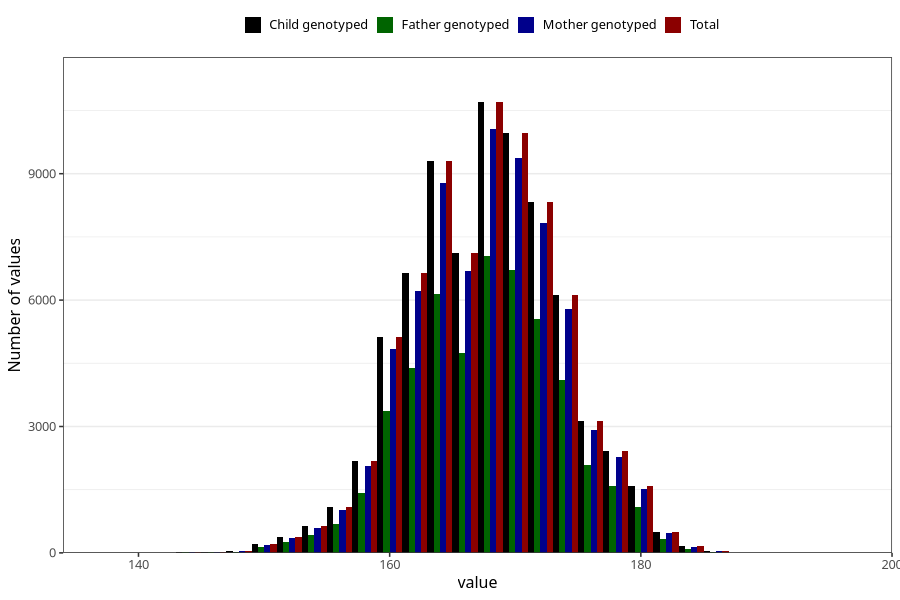

# mother_height_self
Variable mapping to `AA87` in `Skjema1_v12`.
- Number of values:

| Value | Total | Child genotyped | Mother genotyped | Father genotyped |
| ----- | ----- | --------------- | ---------------- | ---------------- |
| Missing | 5360 | 5360 | 5004 | 3041 |
| Non-missing | 75663 | 75663 | 71225 | 50270 |
| 25th percentile | 164 | 164 | 164 | 164 |
| 50th percentile | 168 | 168 | 168 | 168 |
| 75th percentile | 172 | 172 | 172 | 172 |
| Mean | 168.182704888783 | 168.182704888783 | 168.184696384696 | 168.22643723891 |
| Standard deviation | 5.88975610065811 | 5.88975610065811 | 5.89234654654664 | 5.87752800025413 |
| N | 75663 | 75663 | 71225 | 50270 |

