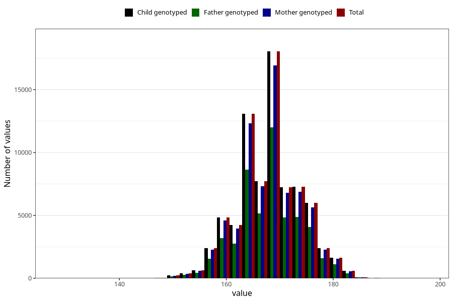

# mother_median_height
Variable created during phenotype curation.
- Number of values:

| Value | Total | Child genotyped | Mother genotyped | Father genotyped |
| ----- | ----- | --------------- | ---------------- | ---------------- |
| Missing | 4088 | 4088 | 3806 | 2182 |
| Non-missing | 76935 | 76935 | 72423 | 51129 |
| 25th percentile | 164 | 164 | 164 | 164 |
| 50th percentile | 168 | 168 | 168 | 168 |
| 75th percentile | 172 | 172 | 172 | 172 |
| Mean | 168.175355819848 | 168.175355819848 | 168.177947613327 | 168.219220012126 |
| Standard deviation | 5.87744555655237 | 5.87744555655237 | 5.88038716586545 | 5.8613675408987 |
| N | 76935 | 76935 | 72423 | 51129 |

