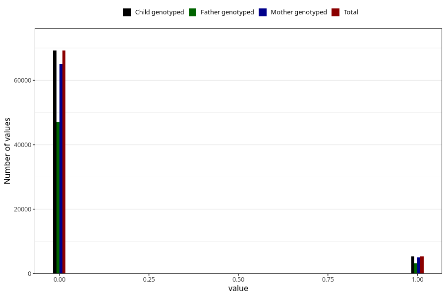

# mother_tongue_farmor
Variable mapping to `AA1312_D` in `Skjema1_v12`.
- Number of values:

| Value | Total | Child genotyped | Mother genotyped | Father genotyped |
| ----- | ----- | --------------- | ---------------- | ---------------- |
| Missing | 6511 | 6511 | 6134 | 2897 |
| Non-missing | 74512 | 74512 | 70095 | 50414 |
| 0 | 69207 | 69207 | 65117 | 47178 |
| 1 | 5305 | 5305 | 4978 | 3236 |

