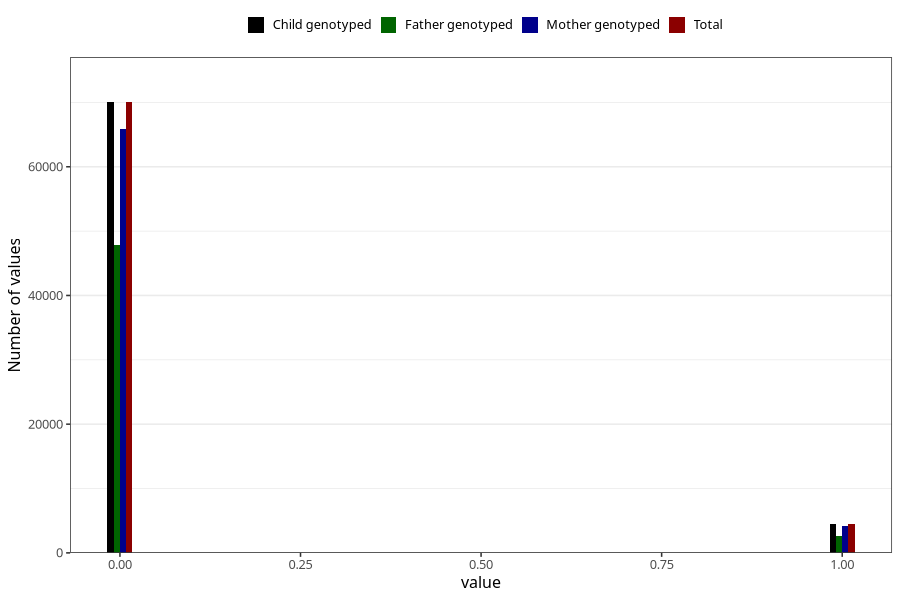

# mother_tongue_father
Variable mapping to `AA1307_D` in `Skjema1_v12`.
- Number of values:

| Value | Total | Child genotyped | Mother genotyped | Father genotyped |
| ----- | ----- | --------------- | ---------------- | ---------------- |
| Missing | 6511 | 6511 | 6134 | 2897 |
| Non-missing | 74512 | 74512 | 70095 | 50414 |
| 0 | 70033 | 70033 | 65890 | 47795 |
| 1 | 4479 | 4479 | 4205 | 2619 |

