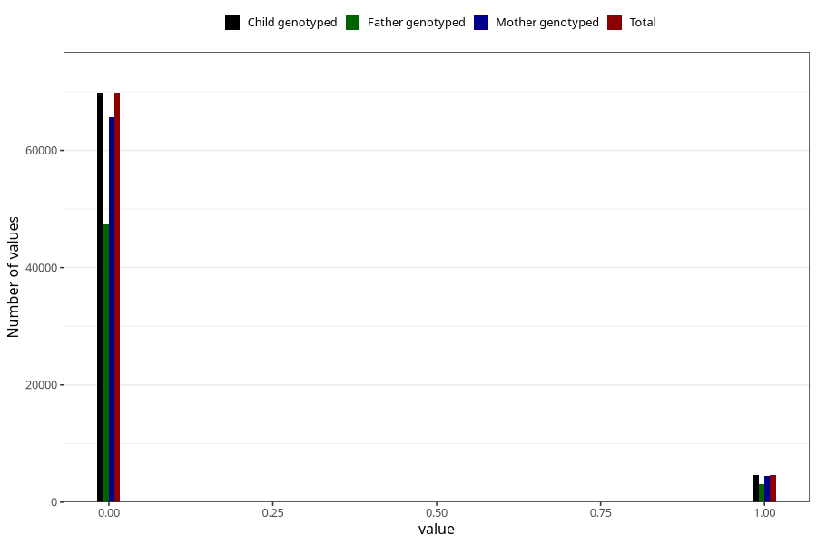

# mother_tongue_morfar
Variable mapping to `AA1311_D` in `Skjema1_v12`.
- Number of values:

| Value | Total | Child genotyped | Mother genotyped | Father genotyped |
| ----- | ----- | --------------- | ---------------- | ---------------- |
| Missing | 6511 | 6511 | 6134 | 2897 |
| Non-missing | 74512 | 74512 | 70095 | 50414 |
| 0 | 69810 | 69810 | 65683 | 47304 |
| 1 | 4702 | 4702 | 4412 | 3110 |

