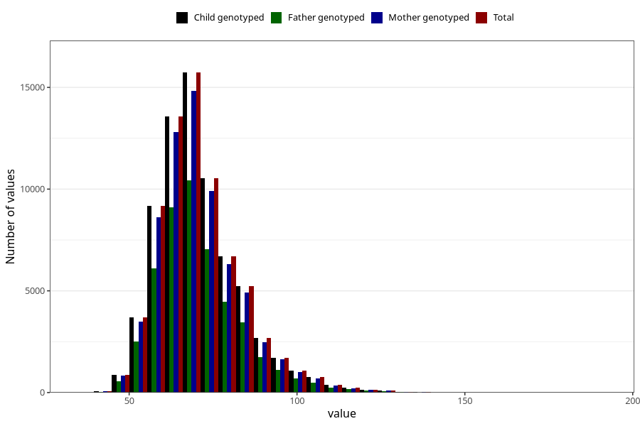

# mother_weight_15w
Variable mapping to `AA86` in `Skjema1_v12`.
- Number of values:

| Value | Total | Child genotyped | Mother genotyped | Father genotyped |
| ----- | ----- | --------------- | ---------------- | ---------------- |
| Missing | 8330 | 8330 | 7811 | 4971 |
| Non-missing | 72693 | 72693 | 68418 | 48340 |
| 25th percentile | 62 | 62 | 62 | 62 |
| 50th percentile | 69 | 69 | 69 | 69 |
| 75th percentile | 77 | 77 | 77 | 77 |
| Mean | 70.9091384314858 | 70.9091384314858 | 70.8870034201526 | 70.8131981795614 |
| Standard deviation | 12.4929214863156 | 12.4929214863156 | 12.4565581990196 | 12.3864211915155 |
| N | 72693 | 72693 | 68418 | 48340 |

