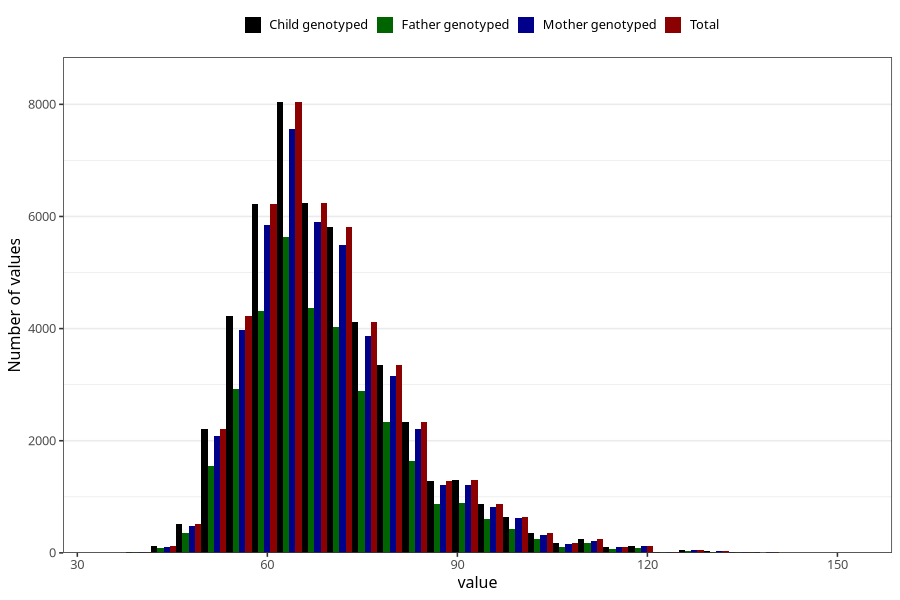

# mother_weight_18m
Variable mapping to `EE924` in `Skjema5_18mnd_v12`.
- Number of values:

| Value | Total | Child genotyped | Mother genotyped | Father genotyped |
| ----- | ----- | --------------- | ---------------- | ---------------- |
| Missing | 32548 | 32548 | 30618 | 19612 |
| Non-missing | 48475 | 48475 | 45611 | 33699 |
| 25th percentile | 60.5 | 60.5 | 60.5 | 60.5 |
| 50th percentile | 67 | 67 | 67 | 67 |
| 75th percentile | 76 | 76 | 76 | 76 |
| Mean | 69.6254481691594 | 69.6254481691594 | 69.5924426125277 | 69.5376687735541 |
| Standard deviation | 12.921545383185 | 12.921545383185 | 12.863826104 | 12.7927471709016 |
| N | 48475 | 48475 | 45611 | 33699 |

