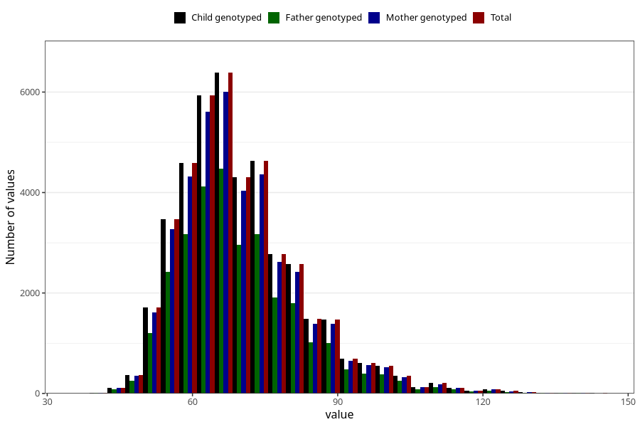

# mother_weight_3y
Variable mapping to `GG501` in `Skjema6_3aar_v12`.
- Number of values:

| Value | Total | Child genotyped | Mother genotyped | Father genotyped |
| ----- | ----- | --------------- | ---------------- | ---------------- |
| Missing | 38249 | 38249 | 35991 | 23748 |
| Non-missing | 42774 | 42774 | 40238 | 29563 |
| 25th percentile | 61 | 61 | 61 | 61 |
| 50th percentile | 68 | 68 | 68 | 68 |
| 75th percentile | 76 | 76 | 76 | 76 |
| Mean | 69.9493874783747 | 69.9493874783747 | 69.9067324419703 | 69.8473937015864 |
| Standard deviation | 12.8574780933437 | 12.8574780933437 | 12.8168228042202 | 12.7481517882712 |
| N | 42774 | 42774 | 40238 | 29563 |

