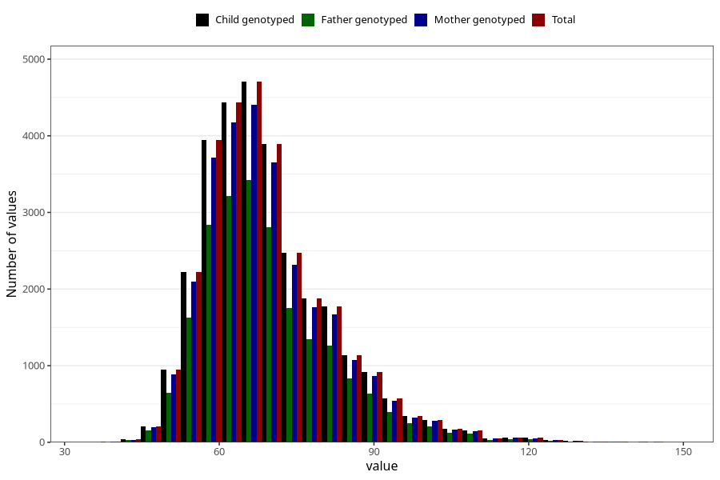

# mother_weight_5y
Variable mapping to `LL339` in `Skjema5aar_v12`.
- Number of values:

| Value | Total | Child genotyped | Mother genotyped | Father genotyped |
| ----- | ----- | --------------- | ---------------- | ---------------- |
| Missing | 50646 | 50646 | 47690 | 31515 |
| Non-missing | 30377 | 30377 | 28539 | 21796 |
| 25th percentile | 61 | 61 | 61 | 61 |
| 50th percentile | 67 | 67 | 67 | 67 |
| 75th percentile | 75.5 | 75.5 | 75.5 | 75 |
| Mean | 69.535227310136 | 69.535227310136 | 69.5128736115491 | 69.4127133418976 |
| Standard deviation | 12.6007268389726 | 12.6007268389726 | 12.5778521029447 | 12.4452464819675 |
| N | 30377 | 30377 | 28539 | 21796 |

