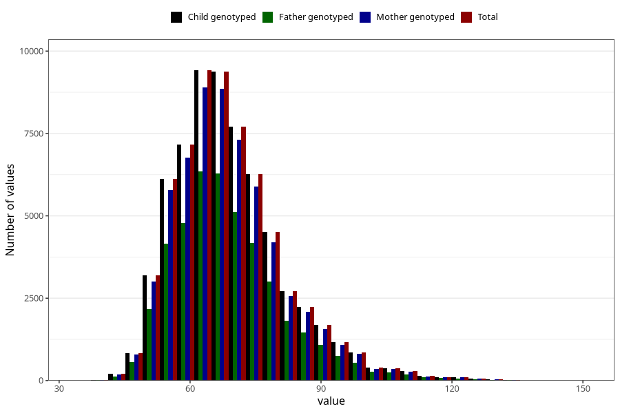

# mother_weight_6m
Variable mapping to `DD673` in `Skjema4_6mnd_v12`.
- Number of values:

| Value | Total | Child genotyped | Mother genotyped | Father genotyped |
| ----- | ----- | --------------- | ---------------- | ---------------- |
| Missing | 16031 | 16031 | 14970 | 9909 |
| Non-missing | 64992 | 64992 | 61259 | 43402 |
| 25th percentile | 60 | 60 | 60 | 60 |
| 50th percentile | 67 | 67 | 67 | 67 |
| 75th percentile | 75 | 75 | 75 | 75 |
| Mean | 69.054005108321 | 69.054005108321 | 69.0086077147848 | 68.9528685314041 |
| Standard deviation | 12.781752977376 | 12.781752977376 | 12.7360977496408 | 12.7404095220201 |
| N | 64992 | 64992 | 61259 | 43402 |

