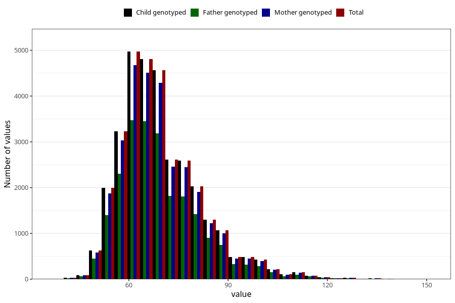

# mother_weight_8y
Variable mapping to `NN284` in `Skjema8aar_v12`.
- Number of values:

| Value | Total | Child genotyped | Mother genotyped | Father genotyped |
| ----- | ----- | --------------- | ---------------- | ---------------- |
| Missing | 48987 | 48987 | 46150 | 30857 |
| Non-missing | 32036 | 32036 | 30079 | 22454 |
| 25th percentile | 61 | 61 | 61 | 61 |
| 50th percentile | 68 | 68 | 68 | 67.5 |
| 75th percentile | 76 | 76 | 76 | 75.2 |
| Mean | 69.7880634286428 | 69.7880634286428 | 69.7524784733535 | 69.6342923309878 |
| Standard deviation | 12.5836553985263 | 12.5836553985263 | 12.5524509675163 | 12.4616834817764 |
| N | 32036 | 32036 | 30079 | 22454 |

