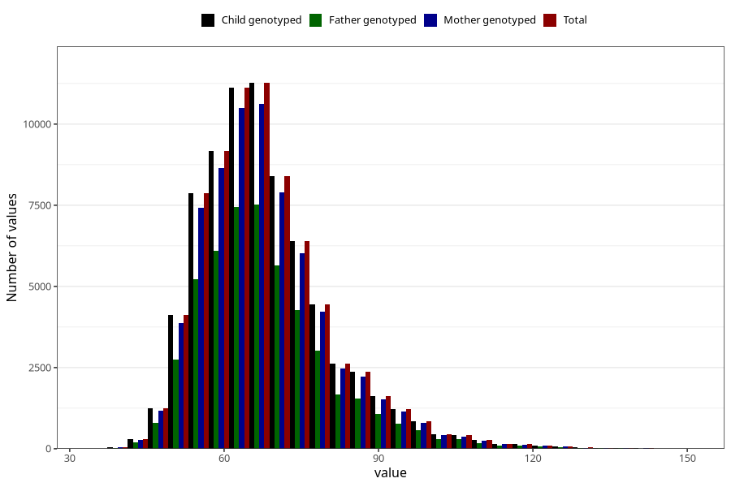

# mother_weight_beginning_self
Variable mapping to `AA85` in `Skjema1_v12`.
- Number of values:

| Value | Total | Child genotyped | Mother genotyped | Father genotyped |
| ----- | ----- | --------------- | ---------------- | ---------------- |
| Missing | 6216 | 6216 | 5815 | 3571 |
| Non-missing | 74807 | 74807 | 70414 | 49740 |
| 25th percentile | 59 | 59 | 59 | 60 |
| 50th percentile | 65 | 65 | 65 | 65 |
| 75th percentile | 74 | 74 | 74 | 74 |
| Mean | 67.9991712005561 | 67.9991712005561 | 67.9748771551112 | 67.9671692802573 |
| Standard deviation | 12.7121349023295 | 12.7121349023295 | 12.669000738174 | 12.6239497937259 |
| N | 74807 | 74807 | 70414 | 49740 |

