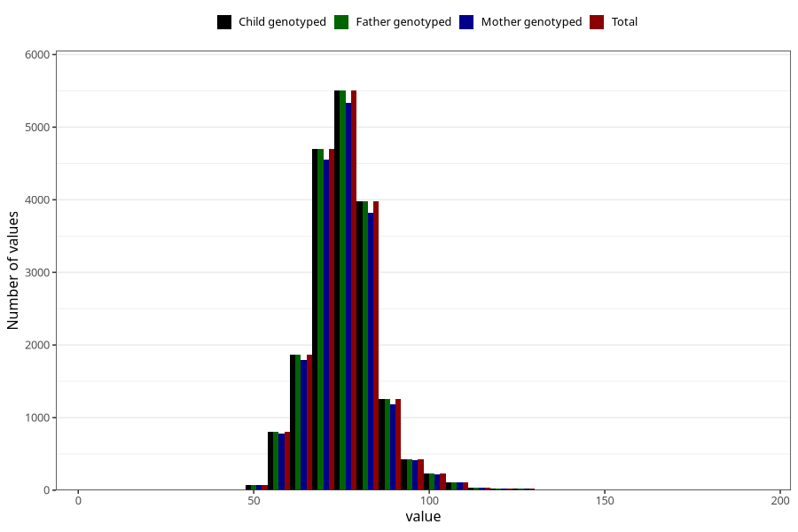

# weight_age_18_father15
Variable mapping to `G__7_1` in `Far2_V12`.
- Number of values:

| Value | Total | Child genotyped | Mother genotyped | Father genotyped |
| ----- | ----- | --------------- | ---------------- | ---------------- |
| Missing | 61974 | 61974 | 57849 | 34262 |
| Non-missing | 19049 | 19049 | 18380 | 19049 |
| 25th percentile | 70 | 70 | 70 | 70 |
| 50th percentile | 75 | 75 | 75 | 75 |
| 75th percentile | 80 | 80 | 80 | 80 |
| Mean | 75.6118956375663 | 75.6118956375663 | 75.5924918389554 | 75.6118956375663 |
| Standard deviation | 9.71932802599039 | 9.71932802599039 | 9.70013926000636 | 9.71932802599039 |
| N | 19049 | 19049 | 18380 | 19049 |

