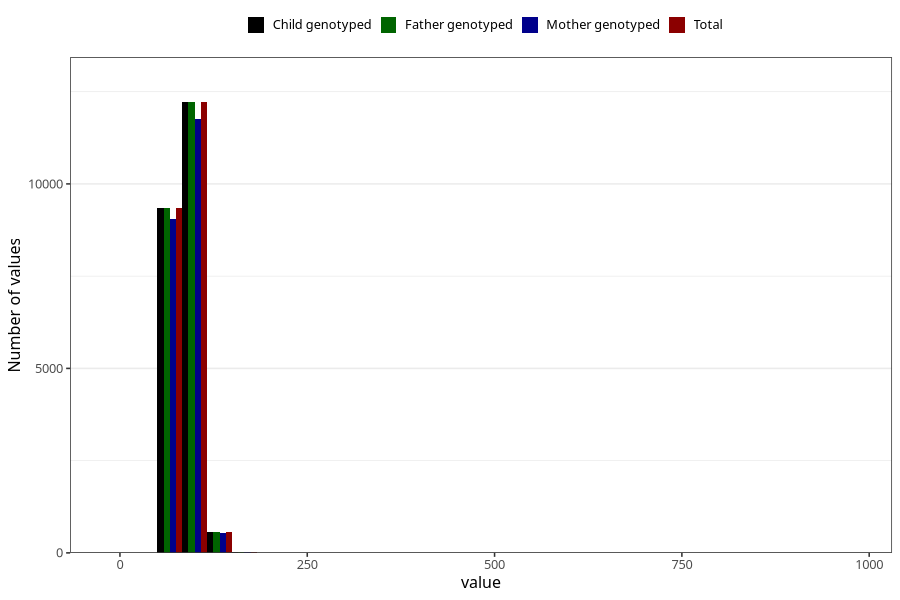

# weight_father15
Variable mapping to `G__6` in `Far2_V12`.
- Number of values:

| Value | Total | Child genotyped | Mother genotyped | Father genotyped |
| ----- | ----- | --------------- | ---------------- | ---------------- |
| Missing | 58873 | 58873 | 54868 | 31161 |
| Non-missing | 22150 | 22150 | 21361 | 22150 |
| 25th percentile | 79 | 79 | 79 | 79 |
| 50th percentile | 85 | 85 | 85 | 85 |
| 75th percentile | 95 | 95 | 95 | 95 |
| Mean | 87.3365688487585 | 87.3365688487585 | 87.2919807125135 | 87.3365688487585 |
| Standard deviation | 14.155161216547 | 14.155161216547 | 14.1534989194121 | 14.155161216547 |
| N | 22150 | 22150 | 21361 | 22150 |

